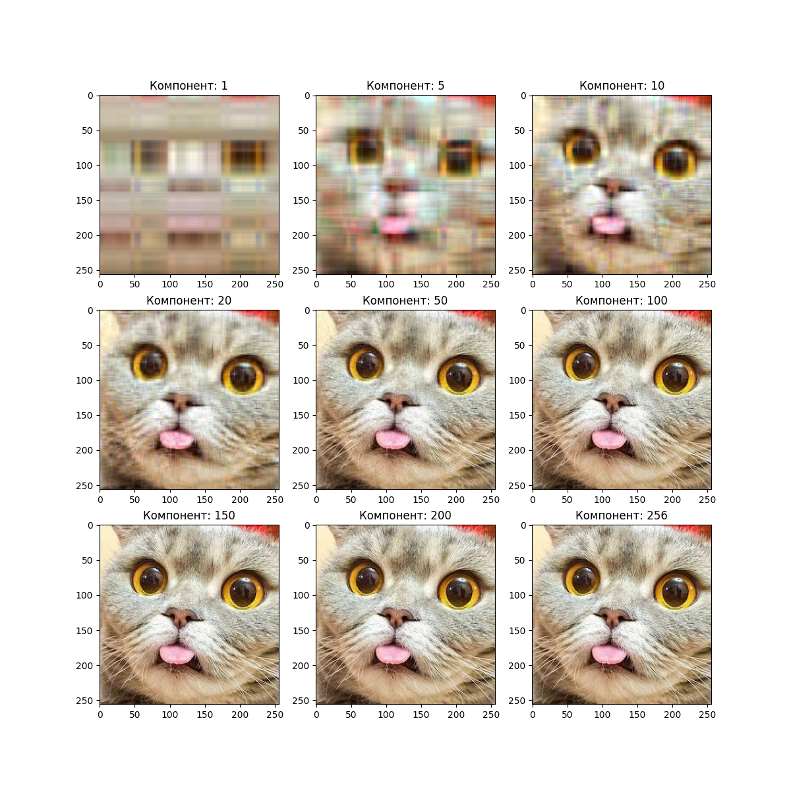
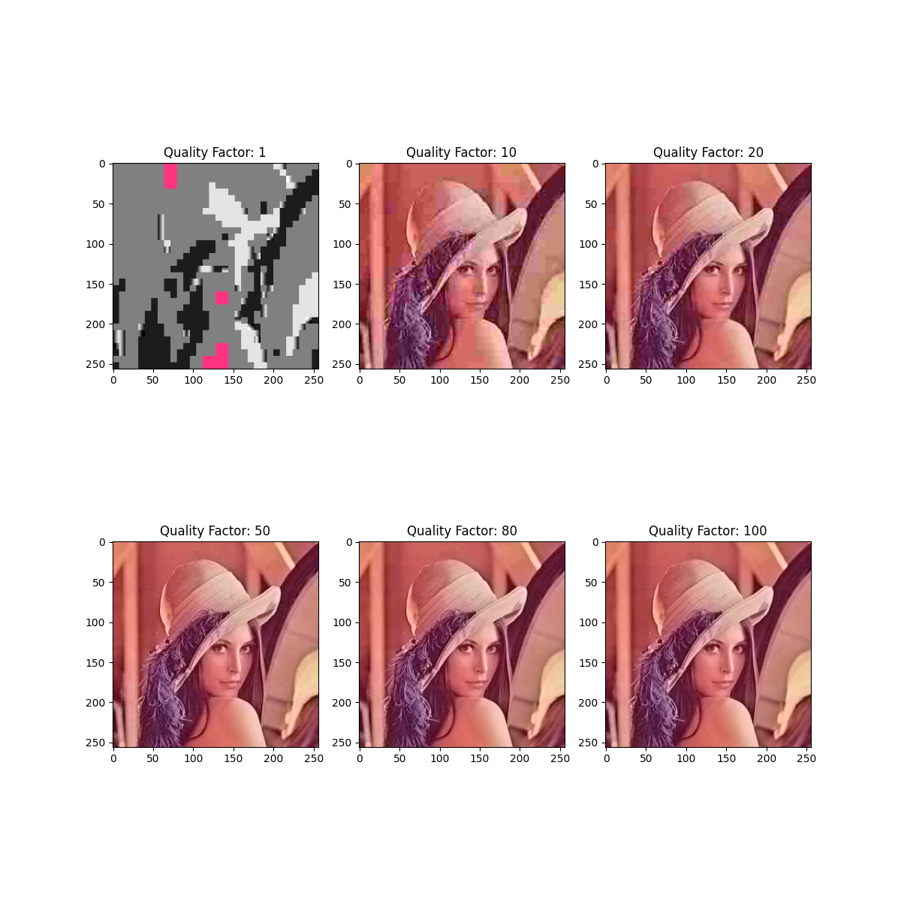
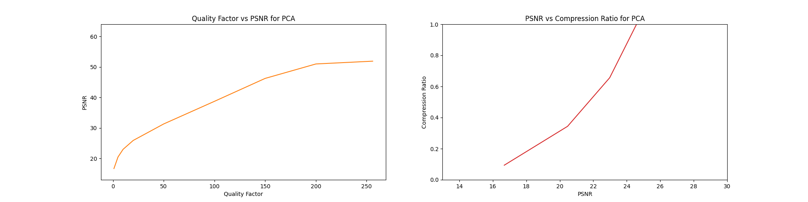

# PCA-and-JPEG-image-compression-methods
PCA and JPEG image compression methods

---

## 🚀 Запуск программы

Для запуска программы:

```bash
python3 image_compression.py
```

---

## 📊 Результаты

После выполнения программы в директории проекта появятся результаты:

| Тип анализа | Файл | Превью | Описание |
|--------------|------|--------|-----------|
| Визуализация PCA | `pca_visualization.png` |  | Пример восстановленного изображения после PCA-сжатия |
| Визуализация JPEG | `jpeg_visualization.png` |  | Пример восстановленного изображения после JPEG-сжатия |
| График PCA | `pca_metrics_graph.png` |  | Зависимость метрик от числа компонент |
| График JPEG | `jpeg_metrics_graph.png` |  | Зависимость метрик от коэффициента качества |

> 💡 При просмотре репозитория на GitHub изображения отображаются прямо в таблице.  
> Если изображения находятся в другой папке (например, `results/`), просто укажи путь:  
> ``.

